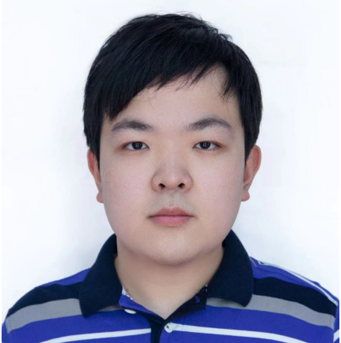
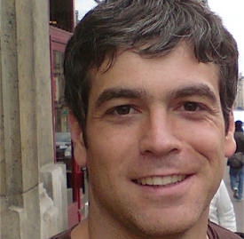
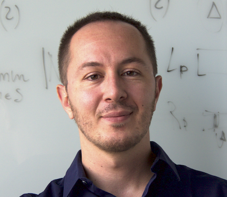

<!-- ## <a name='Overview' style="color: inherit; text-decoration: none; text-align: center;"> The 1st EReL@MIR Workshop on Efficient Representation Learning for Multimodal Information Retrieval</a>  -->
<h1 style="text-align: center; font-size: 28px; color: inherit; line-height: 1.5;">
    
        
    
    The 1st EReL@MIR Workshop on Efficient Representation Learning for Multimodal Information Retrieval
</h1>

Multimodal representation learning has garnered significant attention in the AI community, largely due to the success of large pre-trained multimodal foundation models like LLaMA, GPT, Mistral, and CLIP. These models have achieved remarkable performance across various tasks of multimodal information retrieval (MIR), including web search, cross-modal retrieval, and recommender systems, etc. However, due to their enormous parameter sizes, significant efficiency challenges emerge across training, deployment, and inference stages when adapting these models' representation for IR tasks. These challenges present substantial obstacles to the practical adaptation of foundation models for representation learning in information retrieval tasks.

To address these pressing issues, we propose organizing the first EReL@MIR workshop at the Web Conference 2025, inviting participants to explore novel solutions, emerging problems, challenges, efficiency evaluation metrics and benchmarks. This workshop aims to provide a platform for both academic and industry researchers to engage in discussions, share insights, and foster collaboration toward achieving efficient and effective representation learning for multimodal information retrieval in the era of large foundation models. 

## <a name='Call for Papers' style="color: inherit; text-decoration: none;text-align: center;"> Call for Papers </a> 
We invite researchers to submit their latest work to the EReL@MIR Workshop on fundamental challenges in multimodal representation learning for Multimodal Information Retrieval (MIR). The topics of interest include, but are not limited to:
- Efficient Multimodal Representation Adaptation based on Multimodal Foundation Models
- Data-Efficiency in Multimodal Representation Learning
- Efficient Multimodal Fusion for Representation Learning
- Efficient Cross-Modality Interaction for MIR
- Real-Time Inference for Multimodal Representations
- Efficient MIR Foundation Models
- Benchmarks and Metrics for Multimodal Representation Learning Efficiency

## Submission Guidelines
Submissions of papers must be at least 4 pages and at most 8 pages (including figures, tables, proofs, appendixes, acknowledgments, and any content except references) in length, with unlimited pages for references. Submissions of papers must be in English, in PDF format, in the current ACM two-column conference format. Suitable LaTeX, Word, and Overleaf templates are available from the [ACM Website](https://www.acm.org/publications/proceedings-template) (use the “sigconf” proceedings template for LaTeX and the Interim Template for Word).

<!-- All submissions of papers must be original and have not been published or accepted elsewhere or simultaneously submitted to another journal or conference.-->
 The review process of the submitted manuscripts will be done together with our program committee. The selection will depend on the technical soundness and relevance of submissions to the community that the workshop is targeting. The submission website will be announced soon.

Authors of accepted papers may choose whether to include their work in the WWW'25 Companion proceedings. We will reach out to the authors of accepted papers at a later time to facilitate this decision.
<!-- At least one author of each accepted paper must attend the workshop on-site and present their work. Submissions must be anonymous and should be submitted electronically via EasyChair: <https://easychair.org/conferences/?conf=r3agsigirap2024>. -->

## <a name='Important Dates' style="color: inherit; text-decoration: none; text-align: center;"> Important Dates </a>
- Submission website open: **TBA** 
- Submission Deadlines: **18 December, 2024** 
- Acceptance Notification: **13 January, 2025** 
- Camera-ready: **2 February, 2025** 
- EReL@MIR Workshop: **28-29 April** 
- Deadlines refer to 23:59 (11:59 pm) in the AoE (Anywhere on Earth) time zone.

## <a name='Schedule' style="color: inherit; text-decoration: none; text-align: center;"> Schedule </a>
TBA

## <a name='Organizers' style="color: inherit; text-decoration: none;"> Organizers </a>

  <!-- 第一行 (5 人) -->
  

    <a href="https://gair-lab.github.io/members/2023junchen-fu.html" target="_blank">
      
      
<b>Junchen Fu</b> University of Glasgow

    </a>
  

  
  

    <a href="https://xurige1995.github.io/" target="_blank">
      
      
<b>Xuri Ge</b> Shandong University University of Glasgow

    </a>
  

  
  

    <a href="https://xinxin-me.github.io/" target="_blank">
      
      
<b>Xin Xin</b> Shandong University

    </a>
  

  
  

    <a href="https://ii-research-yu.github.io/" target="_blank">
      
      
<b>Haitao Yu</b> University of Tsukuba

    </a>
  

  
  

    <a href="https://fengyue-leah.github.io/" target="_blank">
      
      
<b>Yue Feng</b> University of Birmingham

    </a>
  

  <!-- 第二行 (3 人) -->
  

    <a href="https://alexiskz.wordpress.com/" target="_blank">
      
      
<b>Alexandros Karatzoglou</b> Amazon

    </a>
  

  
  

    <a href="https://iarapakis.github.io/" target="_blank">
      
      
<b>Ioannis Arapakis</b> Telefónica Scientific Research

    </a>
  

  
  

    <a href="https://www.dcs.gla.ac.uk/~jj/" target="_blank">
      
      
<b>Joemon M. Jose</b> University of Glasgow

    </a>
  

<!-- ## <a name='Organizers' style="color: inherit; text-decoration: none;"> Organizers </a>
- **Junchen Fu**, University of Glasgow, j.fu.3@research.gla.ac.uk

- **Xuri Ge**, Shandong University, xurigexmu@gmail.com

- **Xin Xin**, Shandong University, xinxin@sdu.edu.cn

- **Haitao Yu**, University of Tsukuba, yuhaitao@slis.tsukuba.ac.jp

- **Yue Feng**, University of Birmingham, y.feng.6@bham.ac.uk

- **Alexandros Karatzoglou**, Amazon, alexandros.karatzoglou@gmail.com

- **Ioannis Arapakis**, Telefónica Scientific Research, arapakis.ioannis@gmail.com

- **Joemon M. Jose**, University of Glasgow, joemon.jose@glasgow.ac.uk -->

## <a name='Program Committee' style="color: inherit; text-decoration: none;"> Program Committee</a>
- **Hui Li**, Xiamen University

- **Qian Li**, Beijing University of Posts and Telecommunications

- **Siwei liu**, University of Aberdeen

- **Songpei Xu**, University of Glasgow

- **Xi Wang**, University of Sheffield

- **Jiayi Ji**, National University of Singapore and Xiamen University

- **Hengchang Hu**, National University of Singapore

- **Fuhai Chen**, Fuzhou University

- **Mingyue Cheng**, University of Science and Technology of China

## <a name='Contact' style="color: inherit; text-decoration: none;"> Contact</a>
If you have any questions about the EReL@Workshop, you can contact the following emails:
<ul>
  <li>
    <a href="mailto:j.fu.3@research.gla.ac.uk">j.fu.3@research.gla.ac.uk</a>
  </li>
  <li>
    <a href="mailto:xurigexmu@gmail.com">xurigexmu@gmail.com</a>
  </li>
  <li>
    <a href="mailto:joemon.jose@glasgow.ac.uk">joemon.jose@glasgow.ac.uk</a>
  </li>
</ul>

